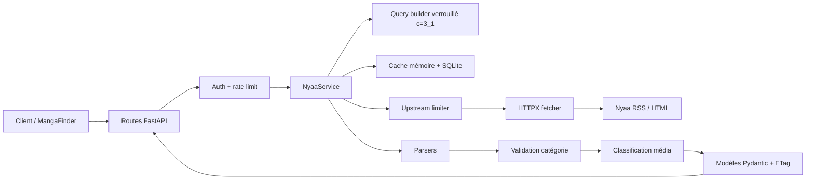
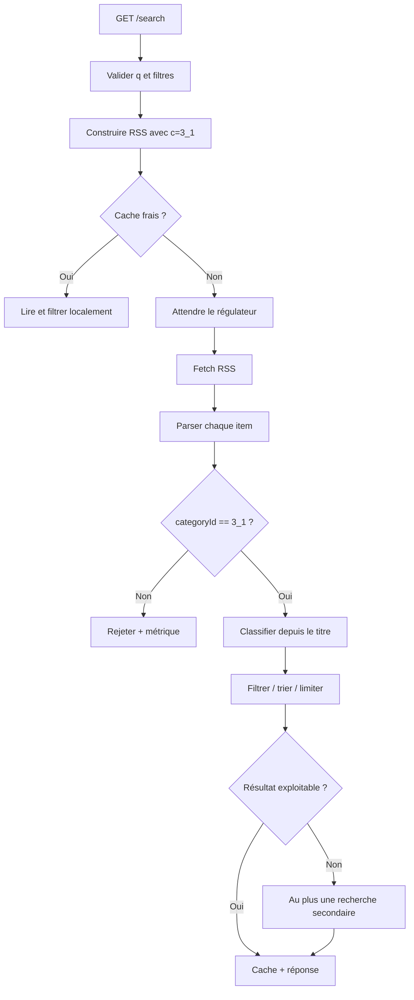
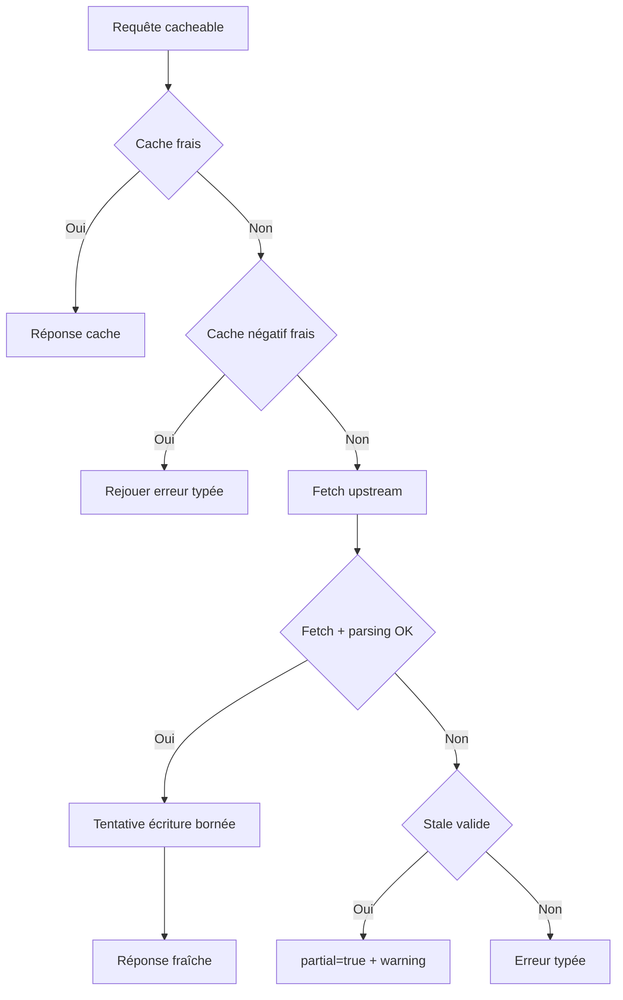

# Architecture et classification

## 1. Vue d'ensemble

## 2. Composants

### Routes FastAPI

- valident strictement les paramètres ;
- appliquent l'authentification et le rate limiting ;
- ne construisent aucune URL upstream ;
- délèguent au service ;
- appliquent ETag et `X-Request-Id`.

### QueryBuilder

Seul composant autorisé à construire des URL Nyaa. Il utilise :

- une base URL validée ;
- `c=3_1` injecté après traitement des paramètres ;
- une table fermée pour filtre, tri et ordre ;
- encodage URL standard ;
- aucune fusion libre de query string utilisateur.

Une méthode de validation relit l'URL finale et vérifie qu'elle contient une et
une seule catégorie égale à `3_1`.

### Fetcher et régulateur upstream

- client HTTP asynchrone partagé ;
- timeout connexion 5 s, total 20 s ;
- redirections suivies uniquement vers les hôtes autorisés ;
- maximum 2 requêtes simultanées ;
- token bucket global de 1 requête/seconde ;
- maximum 2 retries sur erreurs temporaires ;
- backoff avec jitter ;
- respect de `Retry-After` ;
- User-Agent explicite et configurable.

### Parsers

- RSS : chemin principal pour listes et recherches ;
- HTML : fiche détaillée seulement ;
- aucune écriture de HTML normal sur disque ;
- parseurs purs testables avec fixtures ;
- validation Pydantic avant cache ;
- changement de parseur accompagné d'une version de cache.

## 3. Flux de recherche

`include_details=true` ajoute un enrichissement borné après le premier tri afin
de ne pas lire des fiches qui seront ensuite rejetées.

## 4. Classification des médias

### 4.1 Sources d'indices

Le classifieur ne dépend pas d'un modèle externe. Il applique des règles
explicables et versionnées à :

1. titre normalisé Unicode NFKC ;
2. groupes et tags entre crochets ;
3. marqueurs de volume/chapitre/édition ;
4. extensions et chemins de la liste de fichiers, si enrichie ;
5. texte nettoyé de la description ;
6. éditeurs/groupes connus, uniquement comme signal secondaire.

### 4.2 Signaux forts

| Signal | Effet principal |
| --- | --- |
| `manga`, `comic`, `chapter`, `ch.` | favorise `manga` |
| `.cbz`, `.cbr` | favorise fortement `manga` |
| majorité d'images ordonnées | favorise fortement `manga` |
| `light novel`, `LN` non ambigu | favorise fortement `light_novel` |
| `.epub`, `.azw3`, `.mobi` | favorise `novel`/`light_novel` |
| `artbook`, `databook`, `guidebook` | favorise `artbook` |
| `magazine`, `weekly`, `monthly`, issue datée | favorise `magazine` |
| `.pdf` seul | signal faible, jamais suffisant seul |
| `vol`, `volume`, `omnibus` | signal partagé, faible sans contexte |

Les expressions ambiguës comme `LN` doivent être entourées de séparateurs et
ne jamais être détectées à l'intérieur d'un mot.

### 4.3 Calcul

Chaque type accumule un score entre 0 et 1. Le résultat expose :

- type dominant ;
- confiance ;
- signaux non sensibles ;
- version du classifieur en interne/cache.

Seuils :

- ≥ 0,75 : attribution forte ;
- 0,55 à 0,74 : attribution prudente ;
- < 0,55 ou marge trop faible : `unknown`.

Le filtre `media_type=all` exclut `magazine` mais garde `unknown`. Un filtre
spécifique place les `unknown` pertinents après les correspondances confirmées,
au lieu de les supprimer aveuglément.

### 4.4 Recherche secondaire

Si la recherche initiale ne donne aucun résultat exploitable :

- `manga` peut ajouter un unique indice parmi `manga`, `digital`, `volume` ;
- `light_novel` peut ajouter `light novel` ;
- `novel` peut ajouter `epub` ;
- `artbook` peut ajouter `artbook`.

Un seul essai secondaire est autorisé. Il utilise toujours `c=3_1` et le même
filtre de qualité. La réponse indique qu'un fallback a été utilisé.

## 5. Cache

### 5.1 Couches

- L1 mémoire : LRU borné, non persistant ;
- L2 SQLite : cache positif et négatif ;
- cache stale : ancienne entrée servable sur erreur upstream ;
- clés incluant version de schéma, parseur et classifieur.

TTL initiaux :

| Donnée | TTL frais | Stale maximal |
| --- | ---: | ---: |
| latest / search | 300 s | 7 jours |
| resolve | 300 s | 7 jours |
| détail torrent | 21 600 s | 7 jours |
| négatif 404 | 120 s | aucun |
| erreur de parsing répétée | 60 s | aucun |

### 5.2 Plafond disque

Constantes de production :

- `DATA_HARD_LIMIT_BYTES=350000000` ;
- `CACHE_DB_TARGET_BYTES=256000000` ;
- `SQLITE_WAL_HARD_LIMIT_BYTES=32000000` ;
- `MAX_CACHE_ENTRY_BYTES=5000000` ;
- seuil de purge préventive : 90 % du plafond `/data` ;
- diagnostics désactivés par défaut ;
- limite diagnostics si activés : 50 000 000 octets, incluse dans `/data`.

Ordre de purge :

1. entrées négatives expirées ;
2. entrées positives expirées les moins récemment utilisées ;
3. anciens caches de recherche ;
4. anciens détails ;
5. diagnostics les plus anciens.

Avant et après chaque lot d'écritures :

1. calculer la taille réelle de tous les fichiers `/data` ;
2. lancer un checkpoint WAL si nécessaire ;
3. purger jusqu'au seuil cible ;
4. vérifier que l'entrée ne dépasse pas 5 000 000 octets ;
5. conserver une réserve pour le WAL et refuser la transaction si sa taille
   projetée peut franchir l'un des plafonds ;
6. forcer un checkpoint avant que le WAL n'atteigne 32 000 000 octets ;
7. servir néanmoins la réponse non cachée avec warning.

SQLite utilise `busy_timeout`, WAL borné, checkpoints réguliers et un seul
processus Uvicorn en production. `PRAGMA max_page_count` protège également la
taille du fichier principal, sans remplacer le contrôle global de `/data`. La
somme des budgets DB (256 Mo), WAL (32 Mo) et diagnostics (50 Mo) laisse une
réserve de 12 Mo sous le plafond de 350 Mo pour SHM et métadonnées.

## 6. Résilience

## 7. Observabilité locale

- logs structurés compatibles texte/JSON ;
- `X-Request-Id` ;
- temps cache/fetch/parsing/classification ;
- compteurs de catégories rejetées ;
- volume `/data`, taille DB/WAL et nombre de purges ;
- rate limits client/upstream ;
- derniers événements de performance bornés en mémoire ;
- aucune télémétrie distante ;
- aucun token, magnet complet ou requête utilisateur brute dans les logs par
  défaut.
